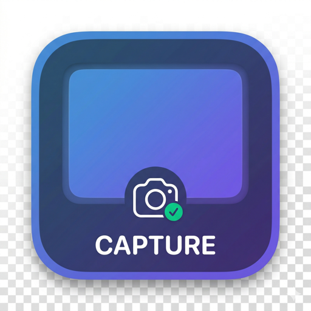

<div align="center">



# Capture Your Screen

**A native macOS screenshot app that freezes the screen before you select, so menus and tooltips come out exactly as you saw them. Every capture is kept in a searchable, day-by-day history.**

[](https://github.com/mammut001/capture-your-screen/releases/latest)


[](LICENSE)

</div>

<!--
  HERO MEDIA — record a 10–15s GIF/MP4 and save it as docs/media/hero.gif, then
  replace this comment with:
  <p align="center"></p>
  Suggested shot: open an app menu → press ⌘⇧A → hover to snap to a window →
  Enter → Annotate → arrow + blur → Copy.
-->

---

## Why another screenshot app?

**📸 It captures exactly what you see.**
Press the hotkey and the screen freezes instantly. Open menus, right-click menus, hover states and tooltips all stay put while you pick the area, so they don't vanish the moment you click.

**🪟 It snaps to windows without clicking.**
Move the pointer over any window and the selection snaps to it. Press Enter to capture, or drag to select a custom area.

**🗓️ It remembers every screenshot.**
Every capture goes into a history in the menu bar, grouped by day. Jump to any date on the calendar, step through the days you took screenshots, search, pin the ones you need, and copy any shot back to the clipboard with one click. Files are saved into dated folders you choose, and that folder can be in iCloud Drive.

**🔒 It's private by design.**
The app runs in the macOS sandbox with **no network entitlement**. It has no accounts, no uploads and no analytics, and it cannot connect to the internet at all.

## Features

- **Freeze-frame capture** built on ScreenCaptureKit
- **Hover-to-snap window selection** or free-form area selection
- **Post-capture panel**: Copy, Annotate, Share, or discard
- **Annotation editor**: arrows, text, rectangles, ellipses, numbered steps, pixelate and blur
- **Text recognition (OCR)** in the annotation editor, powered by the Vision framework on your Mac
- **Menu bar history** grouped by day, with a calendar, Today / Yesterday filters, search and pinning
- **Safe delete**: deleted screenshots go to the Trash, so they can be recovered
- **PNG or JPEG**, a custom save folder, a customizable global hotkey, and launch at login
- **Universal build** for Apple Silicon and Intel, signed and notarized by Apple

## Keyboard shortcuts

| Action | Keys |
|---|---|
| Start a capture (customizable) | <kbd>⌘</kbd> <kbd>⇧</kbd> <kbd>A</kbd> |
| Confirm the selection and open the action panel | <kbd>Return</kbd> |
| Skip the panel: copy **and** save right away | <kbd>⌘</kbd> <kbd>Return</kbd> |
| Cancel | <kbd>Esc</kbd> |
| In the action panel: Copy · Annotate · Share | <kbd>⌘</kbd> <kbd>C</kbd> · <kbd>⌘</kbd> <kbd>E</kbd> · <kbd>⇧</kbd> <kbd>⌘</kbd> <kbd>S</kbd> |
| In the menu bar panel: take a screenshot · Settings · Quit | <kbd>Space</kbd> · <kbd>⌘</kbd> <kbd>,</kbd> · <kbd>⌘</kbd> <kbd>Q</kbd> |

## Install

1. Download `capture-your-screen-<version>-macos.zip` from the [latest release](https://github.com/mammut001/capture-your-screen/releases/latest).
2. Unzip it and drag **capture-your-screen.app** into **Applications**.
3. Open it. A camera icon appears in the menu bar.
4. On the first capture, macOS asks for **Screen Recording** permission. Enable it in **System Settings → Privacy & Security → Screen Recording**, then quit and reopen the app.
5. Choose where screenshots are saved when prompted. `~/Pictures/Screenshots` or an iCloud Drive folder both work well.

> **Upgrading from 1.2.x or earlier?** Starting with 1.3.0 the app is signed with a Developer ID, so macOS asks for Screen Recording permission once more after you upgrade.

**Requirements:** macOS 14 Sonoma or later.

## Roadmap

- [ ] One-shot **Capture Text**: select an area and copy its text, with no image saved
- [ ] **Search history by the text inside screenshots**, for example to find "that error message from last week"
- [ ] Drag screenshots straight from the history into other apps
- [ ] Pin a screenshot to float above your windows

Ideas and bug reports are welcome in [Issues](https://github.com/mammut001/capture-your-screen/issues).

---

## For developers and automation: `capture-screen-helper`

The repo also ships a small, **read-only** command-line tool that reuses the app's ScreenCaptureKit pipeline. It lets scripts and AI agents (such as [Conveyor](https://github.com/mammut001/Conveyor)) take a screenshot safely.

```bash
capture-screen-helper --check-permission --json

capture-screen-helper --mode full-display --display main \
  --output /absolute/path/screenshot.png --json
```

It captures the main display to a PNG and prints JSON metadata to stdout (path, SHA-256, dimensions, display ID, timestamp). It deliberately does **not** move the mouse, type, control apps, upload, touch the clipboard, delete files or emit base64 image data. It is an observation primitive, not a computer-control tool.

If Screen Recording permission is missing, it returns a structured error instead of failing silently:

```json
{
  "ok": false,
  "error": "screen_recording_permission_required",
  "message": "Screen Recording permission is required.",
  "hint": "Open System Settings → Privacy & Security → Screen Recording"
}
```

A notarized universal binary is attached to each [release](https://github.com/mammut001/capture-your-screen/releases/latest). Supported flags: `--mode full-display`, `--display main`, `--output`, `--json` and `--check-permission`. Unsupported arguments exit non-zero with safe JSON.

## Build from source

```bash
git clone https://github.com/mammut001/capture-your-screen.git
cd capture-your-screen
open capture-your-screen.xcodeproj   # run the "capture-your-screen" scheme

bash scripts/build_helper.sh         # builds and self-tests the CLI helper
```

The code is organized into `Capture/` (freeze-frame overlay and window snapping), `Annotation/` (editor, renderer, compositor), `MenuBar/` (history panel and settings) and `capture-screen-helper/` (the CLI tool). Real screen capture isn't exercised in headless CI, because macOS Screen Recording consent is interactive.

## License

Capture Your Screen is free software, released under the [GNU General Public License v3.0](LICENSE). You're free to use, study, modify and share it. If you distribute a modified version, it must stay under the GPL, with its source code available.
